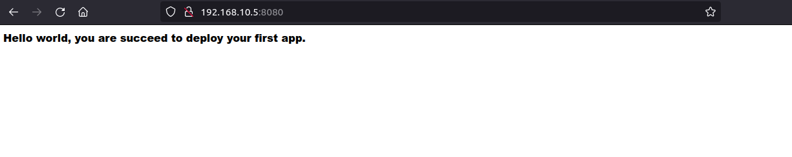

<div id="top"></div>
<!--
*** Thanks for checking out the Best-README-Template. If you have a suggestion
*** that would make this better, please fork the repo and create a pull request
*** or simply open an issue with the tag "enhancement".
*** Don't forget to give the project a star!
*** Thanks again! Now go create something AMAZING! :D
-->


<!-- PROJECT SHIELDS -->
<!--
*** I'm using markdown "reference style" links for readability.
*** Reference links are enclosed in brackets [ ] instead of parentheses ( ).
*** See the bottom of this document for the declaration of the reference variables
*** for contributors-url, forks-url, etc. This is an optional, concise syntax you may use.
*** https://www.markdownguide.org/basic-syntax/#reference-style-links
-->
[![MIT License][license-shield]][license-url]
[![LinkedIn][linkedin-shield]][linkedin-url]


<!-- PROJECT LOGO -->
<br />
<div align="center">
  <a href="https://github.com/Macreti">
    
  </a>

  <h3 align="center">HomeLab 1:  Deploy Website inside Virtual Machine Vagrant
  </h3>

  <p align="center">
    <br />
    <a href="https://github.com/Macreti/deploy-website-in-vm/blob/main/README.md"><strong>Explore the docs »</strong></a>
    <br />
    <br />
  </p>
</div>


<!-- TABLE OF CONTENTS -->
<details>
  <summary>Table of Contents</summary>
  <ol>
    <li>
      <a href="#about-the-project">About The Project</a>
      <ul>
        <li><a href="#built-with">Built With</a></li>
      </ul>
    </li>
    <li>
      <a href="#getting-started">Getting Started</a>
      <ul>
        <li><a href="#prerequisites">Prerequisites</a></li>
        <li><a href="#steps">Steps</a></li>
      </ul>
    </li>
    <li><a href="#usage">Usage</a></li>
    <!--<li><a href="#contributing">Contributing</a></li>-->
    <li><a href="#license">License</a></li>
    <!--<li><a href="#contact">Contact</a></li>
    <li><a href="#acknowledgments">Acknowledgments</a></li> -->
  </ol>
</details>


<!-- ABOUT THE PROJECT -->
## About The Project

In this tutorial we are going to show you how to deploy simple web app inside virtual machine using tools as Vagrant and docker.

Here's why:
* Create an on-premises virtual environment
* Build an app's image using docker and save it to a hub
* Help you understand how a website is deployed on a VPS or Cloud server

<p align="right">(<a href="#top">back to top</a>)</p>


### Built With

This section should list any major frameworks/libraries used to bootstrap your project. Leave any add-ons/plugins for the acknowledgements section. Here are a few examples.

* [![Vagrant][Vagrant-shield]][Vagrant-url]
* [![Docker][Docker-shield]][Docker-url]
* [![Node][Node-shield]][Node-url]
* ![Shell][Shell-shield]

<p align="right">(<a href="#top">back to top</a>)</p>


<!-- GETTING STARTED -->
## Getting Started

My goal is help you to implement on your local machine one environnement that help you to understand how you can reproduce it on your production server. In this case look the VM created as your Cloud server or VPS.

### Prerequisites

Before to begin this tutorial, i assume you are familiar with basic concept of docker (Dockerfile,build image, run image, docker hub) and you are able to create virtual machine with Vagrantfile.

If it's not, this link bellow will help you to know more about it:

* Docker official documetation: https://docs.docker.com/ (1)
* Vagrant official documentation: https://www.vagrantup.com/docs (2)
* Build image with docker: https://techtutorialsite.com/build-create-docker-images/ (3)
* Deploy on the hub: https://techtutorialsite.com/docker-push-images-to-dockerhub/ (4)

Clone the repository https://github.com/Macreti/deploy-website-in-vm


### Steps

1. Install docker and vagrant in your local machine

       To do it check official documentation. :-)

2. Init and build your VM (Virtual Machine)
    
    Create a repository on your local machine where you are init your Vagrantfile, call it as you want.

   ```sh
   mkdir your_name_directory
   cd your_name_directory
   vagrant init
   ```
    After these commands run ls , you can see a file with name Vagrantfile; with your vim or nano open it and read about all inside (that help you if you are beginner).

    You can copy and paste the content of my Vagrantfile (my repository) or you can write your own as you want.

   ```sh
   ls
   ```  
    If your Vagrantfile is ready, build your VM:
   ```sh
   vagrant up 
   ```  
   or
    ```sh
   vagrant up name_of_your_vm
   ``` 

3. Provisionning your VM with shell (if you don't copy & paste the content of my Vagrantfile)

    According to the official documentation you can do it directly on your Vagrantfile or you can write the shell code inside another file and call it in your Vagrantfile.

    I love elegant things, as i done create one file with .sh extension and copy and paste the content of my install_tools.sh inside yours.

   ```sh
   chmod+x your_file.sh
   ```

   Open your Vagrantfile and add the path of your file (You can look how i do it inside my own).

   To update your VM you can do:

    ```sh
   vagrant reload
   ```

   or

   ```sh
   vagrant reload name_of_your_vm
   ```

   You can also run 

   ```sh
   vagrant provision
   ```

   or

   ```sh
   vagrant provision name_of_your_vm
   ```
   Congratulation your VM is ready to work with image or container docker.

   To connect inside your VM run:
   ```sh
   vagrant ssh name_of_your_vm
   ```
   You show something as below:
    <div align="center">
         
    </div>

4. Create your simple app

    In my case i created simple nodeJs app that return "Hello world, you are succeed to deploy your first app".

    You can do the same just to understand how it work. Look at my sample-project.

    You can create your app in another directory out of the directory that contains Vagrantfile (I invited you to do this for more understanding).

5. Build image and deploy to the hub
   This step assume you use my sample-project

    * Create the Dockerfile to the root of your_project.
    ```sh
    cd your_project
    touch Dockerfile
   ```
    * Copy and paste the content of sample-project/Dockerfile inside yours
    * Run the command at the root directory: 
    ```sh
    docker build -t name_of_your_image .
    ```
    * Tag your image with command:
    ```sh 
    docker tag name_of_your_image:tag-name username/name_of_your_image:tag-name
    ```
    * Push on the hub with: 
    ```sh
    docker push username/name_of_your_image:tag-name
    ``` 
    <strong>Warning:</strong> Before push your image on the hub, you must have account on the hub (docker hub for example) and log in before on your local machine with docker login if you use docker hub.

    Read more about docker login on the official documentation (1), to understand more about build image and deploy read (3) and (4).

<p align="right">(<a href="#top">back to top</a>)</p>


6. Deploy inside your vm
Create file with extension .sh and copy the content of file <strong>deploy-site.sh</strong> and paste inside yours. Make it executable and custom the deploy inside the file. You can look example on comment line.

To deploy:
```sh
   ./name_of_your_file
   ```
Go to the browser and lauch http://ip_address:expose_port, in my case http://192.168.10.5:8080

It shows me:
<div aling="center">
     
</div>

<p align="right">(<a href="#top">back to top</a>)</p>

<!-- USAGE EXAMPLES -->
## Usage

This project is designed to make developers and operationals staff understand how to deploy an application or website in a real-world situation. The mounted virtual environment is similar to the servers typically used, whether on classic hosts or cloud solutions such as an ec2 on AWS.

<p align="right">(<a href="#top">back to top</a>)</p>


<!-- CONTRIBUTING 
## Contributing

Contributions are what make the open source community such an amazing place to learn, inspire, and create. Any contributions you make are **greatly appreciated**.

If you have a suggestion that would make this better, please fork the repo and create a pull request. You can also simply open an issue with the tag "enhancement".
Don't forget to give the project a star! Thanks again!

1. Fork the Project
2. Create your Feature Branch (`git checkout -b feature/AmazingFeature`)
3. Commit your Changes (`git commit -m 'Add some AmazingFeature'`)
4. Push to the Branch (`git push origin feature/AmazingFeature`)
5. Open a Pull Request

<p align="right">(<a href="#top">back to top</a>)</p> -->


<!-- LICENSE -->
## License

Distributed under the MIT License. See `LICENSE.txt` for more information.

<p align="right">(<a href="#top">back to top</a>)</p>


<!-- CONTACT 
## Contact

Your Name - [@your_twitter](https://twitter.com/your_username) - email@example.com

Project Link: [https://github.com/your_username/repo_name](https://github.com/your_username/repo_name)

<p align="right">(<a href="#top">back to top</a>)</p> -->


<!-- MARKDOWN LINKS & IMAGES -->
<!-- https://www.markdownguide.org/basic-syntax/#reference-style-links -->
[Vagrant-shield]:https://i8c.be/wp-content/uploads/2020/05/vagrant-logo.png
[Vagrant-url]:https://www.vagrantup.com/
[license-shield]: https://img.shields.io/github/license/othneildrew/Best-README-Template.svg?style=for-the-badge
[Docker-shield]:https://www.nicepng.com/png/detail/325-3250556_manual-docker-logo-svg.png
[Docker-url]:https://www.docker.com/
[license-url]: https://github.com/othneildrew/Best-README-Template/blob/master/LICENSE.txt
[linkedin-shield]: https://img.shields.io/badge/-LinkedIn-black.svg?style=for-the-badge&logo=linkedin&colorB=555
[linkedin-url]: https://www.linkedin.com/in/hermann-songwa-45949018b/
[Node-shield]: https://www.shareicon.net/data/512x512/2015/10/06/112724_development_512x512.png
[Node-url]: https://nodejs.org/
[Shell-shield]:https://4vector.com/i/free-vector-shell-logo_089962_Shell_logo.png
[Svelte.dev]: https://img.shields.io/badge/Svelte-4A4A55?style=for-the-badge&logo=svelte&logoColor=FF3E00
[Svelte-url]: https://svelte.dev/
[Laravel.com]: https://img.shields.io/badge/Laravel-FF2D20?style=for-the-badge&logo=laravel&logoColor=white
[Laravel-url]: https://laravel.com
[Bootstrap.com]: https://img.shields.io/badge/Bootstrap-563D7C?style=for-the-badge&logo=bootstrap&logoColor=white
[Bootstrap-url]: https://getbootstrap.com
[JQuery.com]: https://img.shields.io/badge/jQuery-0769AD?style=for-the-badge&logo=jquery&logoColor=white
[JQuery-url]: https://jquery.com 